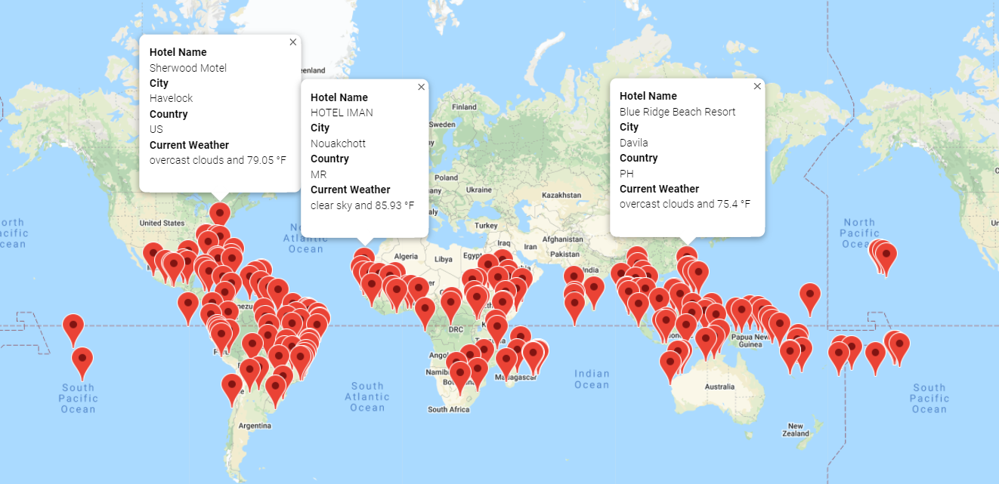

# World_Weather_Analysis
You can find the analysis files here: [Weather_Database](https://github.com/NedaAJ/World_Weather_Analysis/blob/main/Weather_Database.ipynb) | [Vacation_Search](https://github.com/NedaAJ/World_Weather_Analysis/blob/main/Vacation_Search.ipynb) | [Vacation_Itinerary](https://github.com/NedaAJ/World_Weather_Analysis/blob/main/Vacation_Itinerary.ipynb)

## Purpose
The goal of this project is to create a vacation map that allows users to search for suitable travel destinations using meteorological parameters. We also present the user with selected suitable hotels within their preferred trip destinations using Google APIs.

## Overview
In order to create the vacation map, we generated a list of 2,00 random latitudes and longitudes. Using the citipy module, we retrieved and created a list of the closest cities using the coordinates. Then we utilised the OpenWeatherMap API to get the most up-to-date weather data from each city on the list. The map that results displays information of the places on our list, including hotel names, cities, countries, and current weather and descriptions.

## Contact:
- Email : [neda.ahmadi.jesh@gmail.com](mailto:neda.ahmadi.jesh@gmail.com?subject=[GitHub]%20Source%20Han%20Sans)
- Linkedin: www.linkedin.com/in/neda-ahmadi-j
